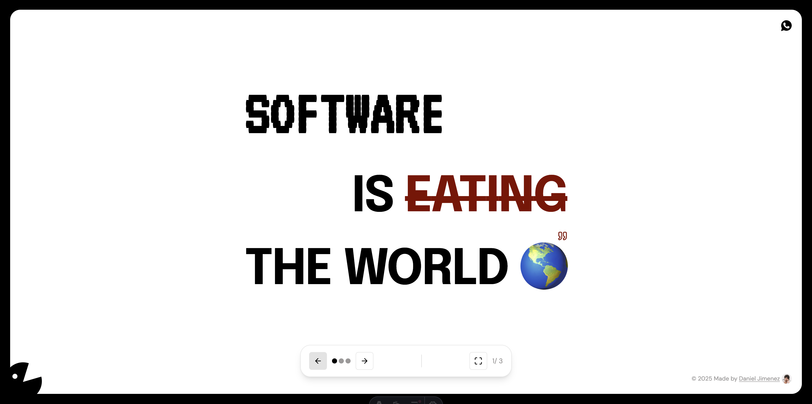

# Daniel Jimenez Portfolio

A modern, interactive portfolio website built with Astro, featuring a unique sliding interface and custom animations. This portfolio showcases a creative approach to web development with custom cursors, interactive elements, and a playful design.

> _"Software is eating the world"_ - Interactive portfolio with custom animations and unique design elements

## 🛠️ Tech Stack

- **Framework**: [Astro](https://astro.build) - Static site generator with component islands
- **Styling**: [TailwindCSS](https://tailwindcss.com) - Utility-first CSS framework
- **Icons**: [Lucide Astro](https://lucide.dev) - Beautiful & consistent icon toolkit
- **State Management**: [Nanostores](https://github.com/nanostores/nanostores) - Tiny state manager
- **Language**: TypeScript for enhanced developer experience

## 🧞 Commands

All commands are run from the root of the project, from a terminal:

| Command                   | Action                                           |
| :------------------------ | :----------------------------------------------- |
| `npm install`             | Installs dependencies                            |
| `npm run dev`             | Starts local dev server at `localhost:4321`      |
| `npm run build`           | Build your production site to `./dist/`          |
| `npm run preview`         | Preview your build locally, before deploying     |
| `npm run astro ...`       | Run CLI commands like `astro add`, `astro check` |
| `npm run astro -- --help` | Get help using the Astro CLI                     |

## 🔗 Contact

Built by [Daniel Jimenez](https://www.linkedin.com/in/dan-jimenez-dev)

---

_"Software is eating the world"_ - This portfolio embodies that philosophy with modern web technologies and creative interaction design.
